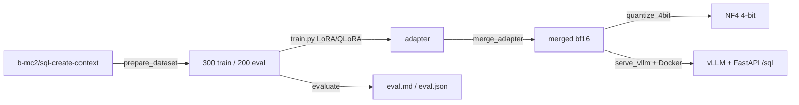

# Qwen3.5-2B Text-to-SQL fine-tune

LoRA / QLoRA fine-tuning of [`Qwen/Qwen3.5-2B`](https://huggingface.co/Qwen/Qwen3.5-2B)
for Text-to-SQL, with NF4 4-bit quantization, an executable-accuracy benchmark,
and vLLM + FastAPI serving.

On a held-out 200-example split the fine-tune lifts **executable accuracy from
67.7% to 87.4%** (42.4% to 68.7% on the stricter literal-seeded variant) and
**exact match from 3% to 52%** over the base model, and the 4-bit copy keeps
that quality at **half the disk footprint**.

## Models and data

| Artifact | Hub |
|---|---|
| Dataset (300 train / 200 eval) | [`Vicen-te/sql-create-context-mini`](https://huggingface.co/datasets/Vicen-te/sql-create-context-mini) |
| LoRA adapter | [`Vicen-te/qwen3.5-2b-sql-lora`](https://huggingface.co/Vicen-te/qwen3.5-2b-sql-lora) |
| Merged model | [`Vicen-te/qwen3.5-2b-sql`](https://huggingface.co/Vicen-te/qwen3.5-2b-sql) |

## Results

Benchmark: 200 held-out examples, greedy decoding, scored against the base
model. Gold-query coverage on the split is 99% (the reference SQL executes).

| Model | Executable acc. | Exec. acc. (seeded) | Exact match | Exact match (loose) | BLEU | Latency (ms/ex) |
|---|---:|---:|---:|---:|---:|---:|
| base (`Qwen3.5-2B`) | 67.7% | 42.4% | 3.0% | 40.0% | 59.4 | 990 |
| **fine-tuned** | **87.4%** | **68.7%** | **52.0%** | **72.0%** | **86.3** | 761 |
| fine-tuned NF4 4-bit | 87.9% | 68.2% | 52.5% | 74.0% | 86.0 | 1166 |

The 4-bit NF4 copy trades **−54% disk** (3.6 GB → 1.67 GB) for half a point on
the seeded executable accuracy and a third of a BLEU point; on 200 examples
that is noise. NF4 saves disk/memory, not time — dequantization makes per-token
inference slower on a consumer GPU.

Metrics, and what they do not measure:
- **Executable accuracy** — run the predicted and gold SQL against the same
  in-memory SQLite schema, filled with five generic rows per table, and compare
  result sets. Those rows never satisfy a `WHERE publisher = "Nintendo"`
  clause: only 5.6% of the gold queries return anything, and two empty results
  count as a match, so the plain number is close to "the prediction executes".
- **Executable accuracy (seeded)** — same, but the rows also contain the
  literals from the gold WHERE clause, so 86.4% of the gold queries return rows
  and the prediction has to filter the same way. This is the number to quote.
  Part of the gap to the plain metric is the fine-tune lower-casing literals
  (`"nintendo"`), which the corpus does not.
- **Exact match** — `sqlglot`-normalized string equality, strict: it keeps quote
  style and case, and the base model writes `'Nintendo'` where the corpus writes
  `"Nintendo"`. **Loose** folds quote style, case and whitespace away; the base
  model's 3% → 40% shows how much of the strict gain is quoting style.
- **BLEU** — `sacrebleu` over the SQL text (surface similarity).
- **Latency** — mean wall-clock per example with `transformers.generate` on an
  RTX 4070 Ti SUPER, `max_new_tokens=256`. Every fine-tuned generation stops on
  `<|im_end|>` (stop rate 100%, base 99.5%), so the column measures the model,
  not the token budget. The first published checkpoint did not stop — see
  [Stop tokens](#stop-tokens).

Every number above is committed, not just quoted:
[`evals/results/`](evals/results/) holds the LoRA report (`eval.md`, `eval.json`
and the bf16-vs-NF4 `quantization.json`) and
[`evals/results-qlora/`](evals/results-qlora/) the QLoRA one, each with the 200
per-example generations under `predictions/` (`gold`, the raw output, the
cleaned SQL, the token count and whether the generation stopped). `id` is the
row index in the eval split, so any example can be looked up — or re-scored —
from the repo alone, no GPU needed.

### Stop tokens

The first published checkpoint produced correct SQL and then never stopped:
every generation ran to `max_new_tokens`, which is why the earlier README showed
7.4 s per example for the fine-tune against 1.1 s for the base. Two things
lined up. `Qwen/Qwen3.5-2B` ships no `generation_config.json`, so a model
loaded from it only stops on `<|endoftext|>`, not on the chat turn end
`<|im_end|>`; and the SFT text ended on `<|im_end|>\n`, so `SFTTrainer`
appended a second `<|im_end|>` and the model learned to continue past the turn
end instead of emitting `<|endoftext|>` as the base does. The training text
now ends on `<|im_end|>`, the merged model carries both stop ids in its
`generation_config.json`, and the eval harness reports the stop rate. The
numbers above, and the checkpoints on the Hub, are from the retrained model.

### LoRA vs QLoRA

QLoRA (base loaded in 4-bit NF4 during training, `configs/train_qlora.yaml`)
matches plain LoRA on this benchmark — training on a quantized base costs no
measurable quality. Both adapters are merged to bf16 and scored on the same
200-example split.

| Training | Executable acc. | Exec. acc. (seeded) | Exact match | Exact match (loose) | BLEU |
|---|---:|---:|---:|---:|---:|
| LoRA (bf16 base) | 87.4% | 68.7% | 52.0% | 72.0% | 86.3 |
| QLoRA (4-bit base) | 88.4% | 71.2% | 54.0% | 72.5% | 87.0 |

The gap is within noise on 200 examples; the takeaway is that QLoRA reaches the
same accuracy at a fraction of the training VRAM. Inference speed is identical —
both merge to a bf16 model, so the 4-bit only ever lives in the training step
(761 vs 758 ms/example, both stopping on every query).

## Pipeline



## Quickstart

```bash
pip install -r requirements.txt

make data        # build the 300/200 split from b-mc2/sql-create-context
make train       # LoRA SFT in bf16            (configs/train_lora.yaml)
make merge       # merge the adapter into the base
make quantize    # NF4 4-bit copy + size/quality report
make evaluate    # base vs ft vs ft-nf4 on the 200-example benchmark
```

For 4-bit training instead of LoRA, use `make train-qlora`. Every script accepts
`--help`; the hyperparameters live in the `configs/` YAMLs.

## Serving

Two containers via Docker Compose: a vLLM OpenAI server and a thin FastAPI
wrapper exposing `/sql`.

```bash
cd docker
docker compose up --build      # vllm :8000, api :8080
```

```bash
curl -X POST http://localhost:8080/sql \
  -H "Content-Type: application/json" \
  -d '{"schema":"CREATE TABLE employees (id INT, name TEXT, salary INT, department TEXT)",
       "question":"What is the average salary per department?"}'
# -> {"sql":"SELECT AVG(salary) FROM employees GROUP BY department", ...}
```

The wrapper rebuilds the training-time prompt and cleans the output; interactive
docs are at `http://localhost:8080/docs`.

> **vLLM note.** The compose file serves the model with the stock
> `vllm/vllm-openai:v0.31.0` image. Releases up to v0.26.0 did not register
> `Qwen3_5ForCausalLM`, so a text-only Qwen3.5 checkpoint was routed through the
> multimodal Qwen3-VL path and crashed
> ([vLLM #39231](https://github.com/vllm-project/vllm/issues/39231)); until
> v0.27.0 this repo served it from a patched image. The upstream fix is not mine:
> a vLLM contributor registered the architecture in
> [#50210](https://github.com/vllm-project/vllm/pull/50210), released in v0.27.0.
> My part was the diagnosis of the two crash sites (also posted on the earlier,
> unmerged attempt [#39316](https://github.com/vllm-project/vllm/pull/39316)) and
> the patched image that bridged the gap; details in `docs/serving.md`.

## How it works

- **Prompt** (`src/sql_ft/prompts.py`) — a system instruction plus a
  `### Schema / ### Question / ### SQL` user turn, rendered through the Qwen chat
  template with thinking mode disabled.
- **Data** (`src/sql_ft/data.py`, `scripts/prepare_dataset.py`) — dedup, filter
  schemas to ≤ 1500 chars, seeded 300/200 split, rendered into one SFT text
  column that ends on the turn-end token `<|im_end|>`.
- **Training** (`scripts/train.py`) — `trl` `SFTTrainer`, LoRA (rank 16, α 32) on
  the linear layers, 3 epochs, bf16 (or 4-bit NF4 for QLoRA), cosine LR 2e-4.
  `scripts/merge_adapter.py` writes `<|im_end|>` and `<|endoftext|>` as stop ids
  into the merged model (`src/sql_ft/tokens.py`).
- **Evaluation** (`src/sql_ft/eval_sql.py`, `scripts/evaluate.py`) — SQLite
  executor (generic and literal-seeded rows) + sqlglot + sacrebleu + stop rate.
- **Serving** (`scripts/serve_vllm.py`, `docker/`) — vLLM OpenAI server + FastAPI
  `/sql`.

See [`docs/`](docs/) for per-area walkthroughs.

## Layout

```
configs/     LoRA / QLoRA training configs
src/sql_ft/  prompts, data, eval metrics, inference clients
scripts/     prepare / train / merge / quantize / evaluate / serve / push
docker/      vLLM + API compose
tests/       CPU unit tests (prompts, data, SQL metrics, stop tokens)
docs/        training, evaluation and serving guides
```

## Requirements

Python ≥ 3.10. Training and serving need an NVIDIA GPU (developed on an RTX 4070
Ti SUPER, CUDA 13). The CPU test suite (`make test`) runs without a GPU.

## Limitations

SQLite-flavoured SQL only; the training set is intentionally small (300 rows).
This is a compact, reproducible fine-tune, not a production Text-to-SQL system.

## License

MIT (this repo). The model inherits Qwen3.5-2B's Apache-2.0 license; the dataset
inherits `b-mc2/sql-create-context`'s CC-BY-4.0.
