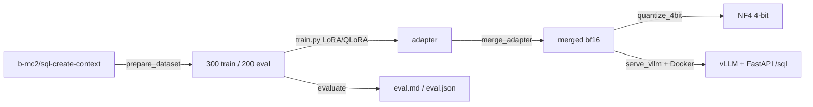

# Qwen3.5-2B Text-to-SQL fine-tune

LoRA / QLoRA fine-tuning of [`Qwen/Qwen3.5-2B`](https://huggingface.co/Qwen/Qwen3.5-2B)
for Text-to-SQL, with NF4 4-bit quantization, an executable-accuracy benchmark,
and vLLM + FastAPI serving.

On a held-out 200-example split the fine-tune lifts **executable accuracy from
67.7% to 87.4%** and **exact match from 3% to 54%** over the base model, and the
4-bit copy keeps that quality at **half the disk footprint**.

## Models and data

| Artifact | Hub |
|---|---|
| Dataset (300 train / 200 eval) | [`Vicen-te/sql-create-context-mini`](https://huggingface.co/datasets/Vicen-te/sql-create-context-mini) |
| LoRA adapter | [`Vicen-te/qwen3.5-2b-sql-lora`](https://huggingface.co/Vicen-te/qwen3.5-2b-sql-lora) |
| Merged model | [`Vicen-te/qwen3.5-2b-sql`](https://huggingface.co/Vicen-te/qwen3.5-2b-sql) |

## Results

Benchmark: 200 held-out examples, greedy decoding, scored against the base
model. Gold-query coverage on the split is 99% (the reference SQL executes).

| Model | Executable acc. | Exact match | BLEU | Latency (ms/ex) |
|---|---:|---:|---:|---:|
| base (`Qwen3.5-2B`) | 67.7% | 3.0% | 59.4 | 1082 |
| **fine-tuned** | **87.4%** | **54.0%** | **86.4** | 7413 |
| fine-tuned NF4 4-bit | 85.9% | 51.0% | 85.9 | 11786 |

The 4-bit NF4 copy trades **−54% disk** (3.6 GB → 1.67 GB) for **−1.5 pts**
executable accuracy and an unchanged BLEU. NF4 saves disk/memory, not time —
dequantization makes per-token inference slower on a consumer GPU.

Metrics:
- **Executable accuracy** — run the predicted and gold SQL against the same
  in-memory SQLite schema and compare result sets (semantic correctness).
- **Exact match** — `sqlglot`-normalized string equality (strict).
- **BLEU** — `sacrebleu` over the SQL text (surface similarity).

## Pipeline



## Quickstart

```bash
pip install -r requirements.txt

make data        # build the 300/200 split from b-mc2/sql-create-context
make train       # LoRA SFT in bf16            (configs/train_lora.yaml)
make merge       # merge the adapter into the base
make quantize    # NF4 4-bit copy + size/quality report
make evaluate    # base vs ft vs ft-nf4 on the 200-example benchmark
```

For 4-bit training instead of LoRA, use `make train-qlora`. Every script accepts
`--help`; the hyperparameters live in the `configs/` YAMLs.

## Serving

Two containers via Docker Compose: a vLLM OpenAI server and a thin FastAPI
wrapper exposing `/sql`.

```bash
cd docker
docker compose up --build      # vllm :8000, api :8080
```

```bash
curl -X POST http://localhost:8080/sql \
  -H "Content-Type: application/json" \
  -d '{"schema":"CREATE TABLE employees (id INT, name TEXT, salary INT, department TEXT)",
       "question":"What is the average salary per department?"}'
# -> {"sql":"SELECT AVG(salary) FROM employees GROUP BY department", ...}
```

The wrapper rebuilds the training-time prompt and cleans the output; interactive
docs are at `http://localhost:8080/docs`.

> **vLLM note.** Stock vLLM 0.23 routes a text-only Qwen3.5 checkpoint through
> the multimodal Qwen3-VL path and crashes
> ([vLLM #39231](https://github.com/vllm-project/vllm/issues/39231)).
> `docker/Dockerfile.vllm` builds a patched image (`docker/patch_vllm_qwen35.py`)
> that skips the vision tower and serves with `--language-model-only`.

## How it works

- **Prompt** (`src/sql_ft/prompts.py`) — a system instruction plus a
  `### Schema / ### Question / ### SQL` user turn, rendered through the Qwen chat
  template with thinking mode disabled.
- **Data** (`src/sql_ft/data.py`, `scripts/prepare_dataset.py`) — dedup, filter
  schemas to ≤ 1500 chars, seeded 300/200 split, rendered into one SFT text
  column.
- **Training** (`scripts/train.py`) — `trl` `SFTTrainer`, LoRA (rank 16, α 32) on
  the linear layers, 3 epochs, bf16 (or 4-bit NF4 for QLoRA), cosine LR 2e-4.
- **Evaluation** (`src/sql_ft/eval_sql.py`, `scripts/evaluate.py`) — SQLite
  executor + sqlglot + sacrebleu.
- **Serving** (`scripts/serve_vllm.py`, `docker/`) — vLLM OpenAI server + FastAPI
  `/sql`.

See [`docs/`](docs/) for per-area walkthroughs.

## Layout

```
configs/     LoRA / QLoRA training configs
src/sql_ft/  prompts, data, eval metrics, inference clients
scripts/     prepare / train / merge / quantize / evaluate / serve / push
docker/      vLLM (patched) + API compose
tests/       CPU unit tests (prompts, data, SQL metrics)
docs/        training, evaluation and serving guides
```

## Requirements

Python ≥ 3.10. Training and serving need an NVIDIA GPU (developed on an RTX 4070
Ti SUPER, CUDA 13). The CPU test suite (`make test`) runs without a GPU.

## Limitations

SQLite-flavoured SQL only; the training set is intentionally small (300 rows).
This is a compact, reproducible fine-tune, not a production Text-to-SQL system.

## License

MIT (this repo). The model inherits Qwen3.5-2B's Apache-2.0 license; the dataset
inherits `b-mc2/sql-create-context`'s CC-BY-4.0.
